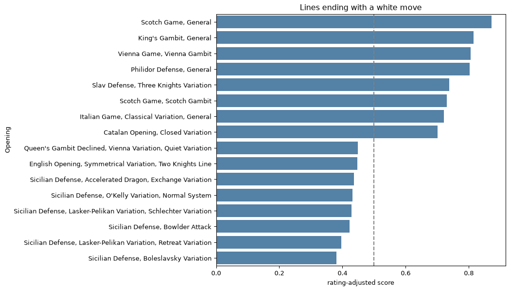
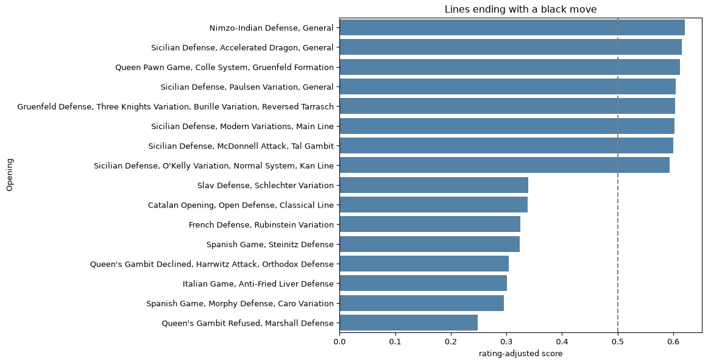
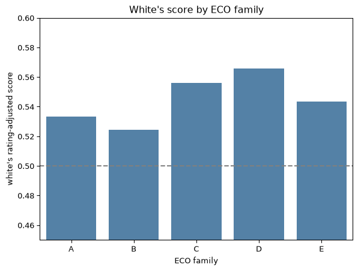
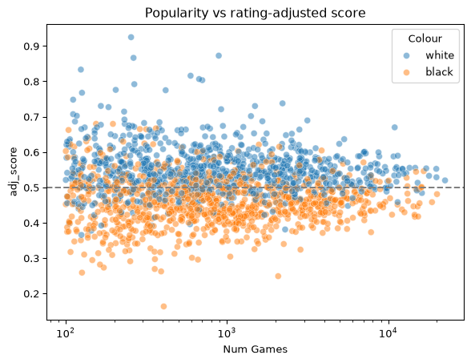
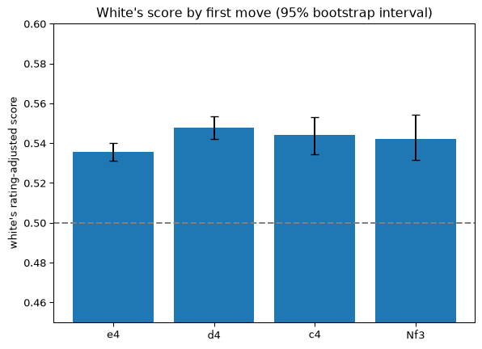
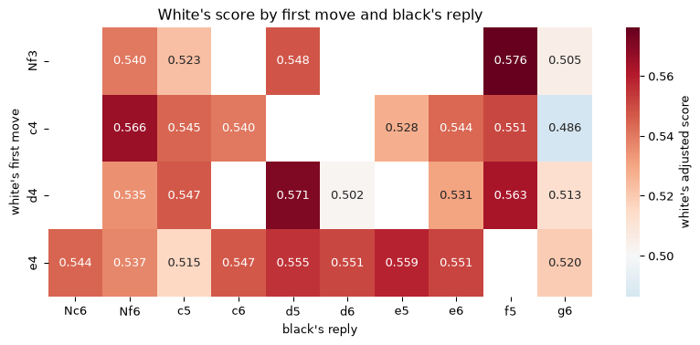
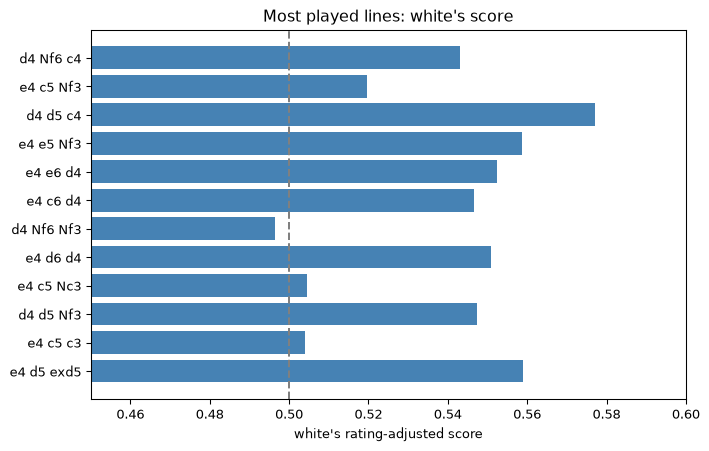

# Chess Openings Analysis
Benjamin Kim

# Chess openings: which ones actually score well?

I wanted to answer three questions with a table of chess opening lines:

1.  Which openings score best and worst?
2.  Do the most popular openings actually do better?
3.  Does the first move (and black’s reply) matter much?

Each row of `openings.csv` is one opening line, a specific sequence of
moves, with the number of games played, the win and draw rates, and the
average rating of the players. Put `openings.csv` in the same folder as
this notebook.

``` python
import numpy as np
import pandas as pd
import matplotlib.pyplot as plt
import seaborn as sns
from scipy import stats

df = pd.read_csv("openings.csv")
print(df.shape)
df.head()
```

    (1884, 26)

<div>
<style scoped>
    .dataframe tbody tr th:only-of-type {
        vertical-align: middle;
    }
&#10;    .dataframe tbody tr th {
        vertical-align: top;
    }
&#10;    .dataframe thead th {
        text-align: right;
    }
</style>

|  | Unnamed: 0 | Opening | Colour | Num Games | ECO | Last Played | Perf Rating | Avg Player | Player Win % | Draw % | ... | move2b | move3w | move3b | move4w | move4b | White_win% | Black_win% | White_odds | White_Wins | Black_Wins |
|----|----|----|----|----|----|----|----|----|----|----|----|----|----|----|----|----|----|----|----|----|----|
| 0 | 0 | Alekhine Defense, Balogh Variation | white | 692 | B03 | 6/22/2018 | 2247 | 2225 | 40.8 | 24.3 | ... | Nd5 | d4 | d6 | Bc4 | NaN | 40.8 | 35.0 | 1.165714 | 282.336 | 242.200 |
| 1 | 1 | Alekhine Defense, Brooklyn Variation | black | 228 | B02 | 6/27/2018 | 2145 | 2193 | 29.8 | 22.4 | ... | Ng8 | NaN | NaN | NaN | NaN | 47.8 | 29.8 | 1.604027 | 108.984 | 67.944 |
| 2 | 2 | Alekhine Defense, Exchange Variation | white | 6485 | B03 | 7/6/2018 | 2244 | 2194 | 40.8 | 27.7 | ... | Nd5 | d4 | d6 | c4 | Nb6 | 40.8 | 31.5 | 1.295238 | 2645.880 | 2042.775 |
| 3 | 3 | Alekhine Defense, Four Pawns Attack | white | 881 | B03 | 6/20/2018 | 2187 | 2130 | 39.7 | 23.2 | ... | Nd5 | d4 | d6 | c4 | Nb6 | 39.7 | 37.1 | 1.070081 | 349.757 | 326.851 |
| 4 | 4 | Alekhine Defense, Four Pawns Attack, Fianchett... | black | 259 | B03 | 5/20/2018 | 2122 | 2178 | 37.8 | 21.2 | ... | Nd5 | d4 | d6 | c4 | Nb6 | 40.9 | 37.8 | 1.082011 | 105.931 | 97.902 |

<p>5 rows × 26 columns</p>
</div>

## 1. Cleaning and setup

- `Color` is the side that made the **last move** of the line. A “white”
  row is a line that ends on a white move (like the Scotch Game after
  3.d4) and a “black” row ends on a black move (like the Sicilian after
  1…c5). I check this below using the move list.
- `Player Win %` and `Draw %` are from the point of view of that side.
- `Num Games` for a line doesn’t seem to include the games of the longer
  lines that continue from it, so I treat every row as its own group of
  games.

``` python
# drop rows missing the columns I need, then tidy up colour and grab the ECO letter (A to E)
df = df.dropna(subset=["Num Games", "Avg Player", "Player Win %", "Draw %"])
df["Color"] = df["Colour"].str.lower().str.strip()
df["eco_family"] = df["ECO"].str[0]

# take move numbers like "1." off the move columns in case they are there
move_cols = ["move1w", "move1b", "move2w", "move2b", "move3w", "move3b", "move4w", "move4b"]
for col in move_cols:
    df[col] = df[col].str.replace(r"^\d+\.+\s*", "", regex=True)

# what does Colour mean? count the moves in each line and see who moved last
num_moves = df["Moves"].str.split().str.len()
last_mover = np.where(num_moves % 2 == 1, "white", "black")
print("share of rows where Colour is the side that moved last:", (last_mover == df["Colour"]).mean())
```

    share of rows where Colour is the side that moved last: 1.0

## 2. Score and rating adjustment

Win rate alone is misleading because draws are common (around 30% of
games). So I use score: a win counts 1, a draw counts 0.5 and a loss
counts 0. A score above 0.5 is a good result for that side.

Stronger players also score a bit better on average (`Avg Player` is the
average rating), which would make lines played by strong players look
good for the wrong reason. To account for that I fit a line of score
against `Avg Player` (separately for white rows and black rows) and
subtract it out. The result is `adj_score`. This is a rough fix because
it only knows the rating of one side, not the opponent’s, so I keep the
raw score next to the adjusted one where it matters.

``` python
# win and draw are from the point of view of the side in the Colour column
df["win"] = df["Player Win %"] / 100
df["draw"] = df["Draw %"] / 100

# score: win = 1, draw = 0.5, loss = 0
df["score"] = df["win"] + 0.5 * df["draw"]

# standard error of the score, used later for error bars
variance = df["win"] + 0.25 * df["draw"] - df["score"] ** 2
df["se"] = np.sqrt(variance.clip(lower=0) / df["Num Games"])

# rating adjustment: fit score vs Avg Player (weighted by games) and remove the slope
df["adj_score"] = df["score"]

for colour in ["white", "black"]:
    rows = df["Colour"] == colour
    x = df.loc[rows, "Avg Player"]
    y = df.loc[rows, "score"]
    games = df.loc[rows, "Num Games"]

    slope, intercept = np.polyfit(x, y, 1, w=np.sqrt(games))
    df.loc[rows, "adj_score"] = y - slope * (x - x.mean())
    print(colour, "rows: 100 more rating points is worth", round(slope * 10000, 1), "points of score")
```

    white rows: 100 more rating points is worth 2.3 points of score
    black rows: 100 more rating points is worth 0.5 points of score

## 3. Best and worst opening lines

I only look at lines with at least 500 games so tiny samples don’t
dominate. The chart shows the 8 best and 8 worst lines for each side
with 95% error bars, and the label includes how often the line ends in a
draw.

``` python
big = df[df["Num Games"] >= 500]

for colour in ["white", "black"]:
    rows = big[big["Colour"] == colour]
    both = pd.concat([rows.nlargest(8, "adj_score"), rows.nsmallest(8, "adj_score")])

    plt.figure(figsize=(8, 7))
    sns.barplot(data=both.sort_values("adj_score", ascending=False), x="adj_score", y="Opening", color="steelblue")
    plt.axvline(0.5, linestyle="--", color="grey")
    plt.title("Lines ending with a " + colour + " move")
    plt.xlabel("rating-adjusted score")
    plt.show()
```





``` python
# the same lines as tables, with the raw score next to the adjusted one
table_cols = ["Opening", "Num Games", "Avg Player", "draw", "score", "adj_score"]

for colour in ["white", "black"]:
    rows = big[big["Colour"] == colour]
    print("Best 5 lines ending with a", colour, "move")
    display(rows.nlargest(5, "adj_score")[table_cols].round(3))
    print("Worst 5 lines ending with a", colour, "move")
    display(rows.nsmallest(5, "adj_score")[table_cols].round(3))
```

    Best 5 lines ending with a white move

<div>
<style scoped>
    .dataframe tbody tr th:only-of-type {
        vertical-align: middle;
    }
&#10;    .dataframe tbody tr th {
        vertical-align: top;
    }
&#10;    .dataframe thead th {
        text-align: right;
    }
</style>

|  | Opening | Num Games | Avg Player | draw | score | adj_score |
|----|----|----|----|----|----|----|
| 1306 | Scotch Game, General | 888 | 1834 | 0.128 | 0.780 | 0.872 |
| 689 | King's Gambit, General | 594 | 1896 | 0.119 | 0.737 | 0.816 |
| 1853 | Vienna Game, Vienna Gambit | 671 | 1941 | 0.145 | 0.738 | 0.806 |
| 955 | Philidor Defense, General | 702 | 2046 | 0.169 | 0.760 | 0.803 |
| 1666 | Slav Defense, Three Knights Variation | 2208 | 2042 | 0.228 | 0.693 | 0.738 |

</div>

    Worst 5 lines ending with a white move

<div>
<style scoped>
    .dataframe tbody tr th:only-of-type {
        vertical-align: middle;
    }
&#10;    .dataframe tbody tr th {
        vertical-align: top;
    }
&#10;    .dataframe thead th {
        text-align: right;
    }
</style>

|  | Opening | Num Games | Avg Player | draw | score | adj_score |
|----|----|----|----|----|----|----|
| 1385 | Sicilian Defense, Boleslavsky Variation | 2292 | 2162 | 0.302 | 0.364 | 0.381 |
| 1480 | Sicilian Defense, Lasker-Pelikan Variation, Re... | 589 | 1814 | 0.199 | 0.298 | 0.396 |
| 1388 | Sicilian Defense, Bowlder Attack | 1705 | 1797 | 0.150 | 0.321 | 0.422 |
| 1481 | Sicilian Defense, Lasker-Pelikan Variation, Sc... | 825 | 1909 | 0.191 | 0.354 | 0.429 |
| 1542 | Sicilian Defense, O'Kelly Variation, Normal Sy... | 1916 | 1962 | 0.198 | 0.368 | 0.431 |

</div>

    Best 5 lines ending with a black move

<div>
<style scoped>
    .dataframe tbody tr th:only-of-type {
        vertical-align: middle;
    }
&#10;    .dataframe tbody tr th {
        vertical-align: top;
    }
&#10;    .dataframe thead th {
        text-align: right;
    }
</style>

|  | Opening | Num Games | Avg Player | draw | score | adj_score |
|----|----|----|----|----|----|----|
| 863 | Nimzo-Indian Defense, General | 1575 | 2110 | 0.267 | 0.614 | 0.621 |
| 1369 | Sicilian Defense, Accelerated Dragon, General | 2107 | 2081 | 0.250 | 0.607 | 0.615 |
| 1028 | Queen Pawn Game, Colle System, Gruenfeld Forma... | 524 | 2097 | 0.271 | 0.605 | 0.612 |
| 1562 | Sicilian Defense, Paulsen Variation, General | 3859 | 2162 | 0.249 | 0.600 | 0.604 |
| 546 | Gruenfeld Defense, Three Knights Variation, Bu... | 1167 | 2309 | 0.355 | 0.606 | 0.603 |

</div>

    Worst 5 lines ending with a black move

<div>
<style scoped>
    .dataframe tbody tr th:only-of-type {
        vertical-align: middle;
    }
&#10;    .dataframe tbody tr th {
        vertical-align: top;
    }
&#10;    .dataframe thead th {
        text-align: right;
    }
</style>

|  | Opening | Num Games | Avg Player | draw | score | adj_score |
|----|----|----|----|----|----|----|
| 1188 | Queen's Gambit Refused, Marshall Defense | 2075 | 1788 | 0.147 | 0.226 | 0.249 |
| 1750 | Spanish Game, Morphy Defense, Caro Variation | 660 | 1833 | 0.167 | 0.275 | 0.296 |
| 590 | Italian Game, Anti-Fried Liver Defense | 606 | 1636 | 0.142 | 0.271 | 0.301 |
| 1113 | Queen's Gambit Declined, Harrwitz Attack, Orth... | 1047 | 2117 | 0.254 | 0.298 | 0.304 |
| 1797 | Spanish Game, Steinitz Defense | 2854 | 1910 | 0.193 | 0.308 | 0.324 |

</div>

``` python
# how many lines are clearly better or worse than the average line?
# "clearly" = at least 3 points of score away from average AND outside the 95% error bar
for colour in ["white", "black"]:
    rows = big[big["Colour"] == colour]
    average = np.average(rows["adj_score"], weights=rows["Num Games"])
    gap = rows["adj_score"] - average
    clear = (gap.abs() >= 0.03) & (gap.abs() > 1.96 * rows["se"])
    print(colour, ":", clear.sum(), "of", len(rows), "lines are clearly different from average (average score", round(average, 3), ")")
```

    white : 295 of 561 lines are clearly different from average (average score 0.542 )
    black : 354 of 634 lines are clearly different from average (average score 0.462 )

### What the leaderboard shows

- **The two charts agree about the Sicilian.** Sicilian lines are five
  of the top eight for black (adjusted score around 0.60), and six of
  white’s eight worst lines are Sicilians too (about 0.38 to 0.44,
  including Boleslavsky, Bowlder Attack and Lasker-Pelikan). Seeing the
  same pattern from both sides makes me trust it.
- **Some of the extreme scores look too good to be real.** “Scotch Game,
  General” at the top for white (about 0.87) is just the line after
  3.d4: 888 games, an average rating of 1,834 (most lines are around
  2,240) and only 13% draws. Its raw score is 0.78, and the adjustment
  adds about 9 points because the rating is low. The same opening name
  on the longer line (3…exd4 4.Nxd4) has a raw score of 0.62, and
  “Philidor Defense, General” (the line after 3.d4) shows the same
  thing. My guess is that these short lines collect games where the
  opponent left the usual moves early, so the score reflects that more
  than the strength of the opening.
- **About half of the lines are clearly different from average**, but
  with this many games almost any gap is statistically significant,
  which is why I also required a gap of at least 3 points.

So this is useful for spotting patterns like the Sicilian, but I
wouldn’t use it to name “the best opening”.

White rows and black rows describe the same thing from opposite sides,
so I flip everything to **white’s point of view** and combine them. The
helper function `summarize` does a games-weighted average for any
grouping, and I reuse it in the later sections.

``` python
# put everything from white's point of view so white rows and black rows can be combined
is_white = df["Color"] == "white"
df["white_adj"] = np.where(is_white, df["adj_score"], 1 - df["adj_score"])
df["white_win"] = np.where(is_white, df["win"], 1 - df["win"] - df["draw"])

# redo the 500+ games filter so it includes the new white columns
big = df[df["Num Games"] >= 500]


def summarize(data, by):
    # games-weighted average of white's score, win rate and draw rate for each group
    data = data.copy()
    data["score_x_games"] = data["white_adj"] * data["Num Games"]
    data["win_x_games"] = data["white_win"] * data["Num Games"]
    data["draw_x_games"] = data["draw"] * data["Num Games"]

    out = data.groupby(by).agg(
        openings=("Opening", "count"),
        games=("Num Games", "sum"),
        score_x_games=("score_x_games", "sum"),
        win_x_games=("win_x_games", "sum"),
        draw_x_games=("draw_x_games", "sum"),
    )
    out["white_score"] = out["score_x_games"] / out["games"]
    out["white_win"] = out["win_x_games"] / out["games"]
    out["draw_rate"] = out["draw_x_games"] / out["games"]
    return out[["openings", "games", "white_score", "white_win", "draw_rate"]].reset_index()


eco = summarize(big, "eco_family")
display(eco.round(3))

sns.barplot(data=eco, x="eco_family", y="white_score", color="steelblue")
plt.axhline(0.5, linestyle="--", color="grey")
plt.ylim(0.45, 0.6)
plt.xlabel("ECO family")
plt.ylabel("white's rating-adjusted score")
plt.title("White's score by ECO family")
plt.show()
```

<div>
<style scoped>
    .dataframe tbody tr th:only-of-type {
        vertical-align: middle;
    }
&#10;    .dataframe tbody tr th {
        vertical-align: top;
    }
&#10;    .dataframe thead th {
        text-align: right;
    }
</style>

|     | eco_family | openings | games   | white_score | white_win | draw_rate |
|-----|------------|----------|---------|-------------|-----------|-----------|
| 0   | A          | 256      | 805315  | 0.533       | 0.377     | 0.313     |
| 1   | B          | 316      | 1062289 | 0.524       | 0.377     | 0.291     |
| 2   | C          | 253      | 539219  | 0.556       | 0.394     | 0.317     |
| 3   | D          | 200      | 481491  | 0.566       | 0.390     | 0.353     |
| 4   | E          | 170      | 413919  | 0.544       | 0.384     | 0.339     |

</div>



### What the ECO families show

White scores above 0.5 in every family. Family D (Queen’s Gambit and
friends) is the best for white at roughly 0.57, and family B (the
Sicilian and other semi-open games) is the lowest at roughly 0.52, so
that is where black gets closest to equal. The draw rates match what I
would expect from chess: D and E are the drawiest (about 34% to 35%) and
B has the fewest draws (about 29%). Closed positions lead to more draws
and the Sicilian leads to sharper, more decisive games.

## 5. Do popular openings do better?

Each dot is one opening line. The x-axis is how many games it has (log
scale) and the y-axis is its rating-adjusted score. I use Spearman
correlation because it only cares about rank, so the log scale doesn’t
matter.

``` python
pop = df[df["Num Games"] >= 50]

sns.scatterplot(data=pop, x="Num Games", y="adj_score", hue="Colour", alpha=0.5)
plt.xscale("log")
plt.axhline(0.5, linestyle="--", color="grey")
plt.title("Popularity vs rating-adjusted score")
plt.show()

results = []
for colour in ["white", "black"]:
    rows = pop[pop["Colour"] == colour]
    raw = stats.spearmanr(rows["Num Games"], rows["score"])
    adj = stats.spearmanr(rows["Num Games"], rows["adj_score"])
    results.append([colour, raw.statistic, raw.pvalue, adj.statistic, adj.pvalue])

pd.DataFrame(results, columns=["colour", "rho_raw", "p_raw", "rho_adjusted", "p_adjusted"]).round(3)
```



<div>
<style scoped>
    .dataframe tbody tr th:only-of-type {
        vertical-align: middle;
    }
&#10;    .dataframe tbody tr th {
        vertical-align: top;
    }
&#10;    .dataframe thead th {
        text-align: right;
    }
</style>

|     | colour | rho_raw | p_raw | rho_adjusted | p_adjusted |
|-----|--------|---------|-------|--------------|------------|
| 0   | white  | -0.051  | 0.129 | -0.055       | 0.098      |
| 1   | black  | 0.032   | 0.307 | 0.028        | 0.376      |

</div>

### What popularity shows

There is no relationship between how often a line is played and how well
it scores. The cloud is flat and the correlations are close to zero. The
one clear pattern is the funnel shape: rare lines (100 to 300 games) are
all over the place, from about 0.2 to 0.9, and the spread shrinks as the
number of games grows. That is mostly small-sample noise. The most
popular lines sit in a tight band, roughly 0.5 to 0.6 for white and 0.42
to 0.52 for black.

Popular does not mean better. People pick openings for lots of reasons
that have nothing to do with the score.

## 6. White’s first move

Now I use the move columns. For each first move I take the
games-weighted score from white’s point of view, and only keep first
moves that make up at least 1% of all games.

The error bars come from a bootstrap: I resample the opening lines
(rows) with replacement 1,000 times and recompute each first move’s
score. I did this instead of a normal standard error because the rows
are not independent games, and a standard error would make the bars look
much tighter than they should.

``` python
# only rows where the first move is known
fm = df.dropna(subset=["move1w"])

first = summarize(fm, "move1w")
first = first[first["games"] >= 0.01 * first["games"].sum()].sort_values("games", ascending=False)

# bootstrap for the error bars
fm = fm.assign(score_x_games=fm["white_adj"] * fm["Num Games"])
boot = []
for i in range(1000):
    sample = fm.sample(len(fm), replace=True, random_state=i)
    totals = sample.groupby("move1w")[["score_x_games", "Num Games"]].sum()
    boot.append(totals["score_x_games"] / totals["Num Games"])
boot = pd.DataFrame(boot)

first["ci_low"] = first["move1w"].map(boot.quantile(0.025))
first["ci_high"] = first["move1w"].map(boot.quantile(0.975))
display(first.round(3))

plt.bar(first["move1w"], first["white_score"],
        yerr=[first["white_score"] - first["ci_low"], first["ci_high"] - first["white_score"]],
        capsize=4)
plt.axhline(0.5, linestyle="--", color="grey")
plt.ylim(0.45, 0.6)
plt.ylabel("white's rating-adjusted score")
plt.title("White's score by first move (95% bootstrap interval)")
plt.show()
```

<div>
<style scoped>
    .dataframe tbody tr th:only-of-type {
        vertical-align: middle;
    }
&#10;    .dataframe tbody tr th {
        vertical-align: top;
    }
&#10;    .dataframe thead th {
        text-align: right;
    }
</style>

|     | move1w | openings | games   | white_score | white_win | draw_rate | ci_low | ci_high |
|-----|--------|----------|---------|-------------|-----------|-----------|--------|---------|
| 11  | e4     | 950      | 1691765 | 0.536       | 0.385     | 0.298     | 0.531  | 0.540   |
| 10  | d4     | 734      | 1308961 | 0.548       | 0.386     | 0.331     | 0.542  | 0.553   |
| 8   | c4     | 103      | 259049  | 0.544       | 0.377     | 0.338     | 0.535  | 0.553   |
| 3   | Nf3    | 49       | 142996  | 0.542       | 0.377     | 0.332     | 0.531  | 0.554   |

</div>



### What the first move shows

The first move only matters a little. d4 is highest at about 0.548, then
c4 (0.544), Nf3 (0.542) and e4 (0.536), which is a spread of about one
point. Looking at the table, e4 and d4 give white almost the same win
rate (about 38.5%), but d4 has more draws (33% vs 30%), which means
black wins less often against d4. So e4 is not worse because white wins
less, it is worse because black gets more chances to win.

A one point gap is small next to what happens on move two, which is what
the next section looks at.

## 7. Black’s reply

Same idea, but now grouped by white’s first move and black’s reply. A
few lines with very few games make noisy cells, so I only keep
combinations with at least 5,000 games.

``` python
# keep rows where black's reply is known and white played one of the main first moves
with_reply = fm.dropna(subset=["move1b"])
main_moves = first["move1w"]

replies = summarize(with_reply[with_reply["move1w"].isin(main_moves)], ["move1w", "move1b"])
replies = replies[replies["games"] >= 5000]
display(replies.sort_values("games", ascending=False).round(3))

grid = replies.pivot(index="move1w", columns="move1b", values="white_score")

plt.figure(figsize=(10, 4))
sns.heatmap(grid, annot=True, fmt=".3f", cmap="RdBu_r", center=0.5,
            cbar_kws={"label": "white's adjusted score"})
plt.xlabel("black's reply")
plt.ylabel("white's first move")
plt.title("White's score by first move and black's reply")
plt.show()
```

<div>
<style scoped>
    .dataframe tbody tr th:only-of-type {
        vertical-align: middle;
    }
&#10;    .dataframe tbody tr th {
        vertical-align: top;
    }
&#10;    .dataframe thead th {
        text-align: right;
    }
</style>

|     | move1w | move1b | openings | games  | white_score | white_win | draw_rate |
|-----|--------|--------|----------|--------|-------------|-----------|-----------|
| 36  | e4     | c5     | 264      | 737822 | 0.515       | 0.368     | 0.291     |
| 21  | d4     | Nf6    | 387      | 729601 | 0.535       | 0.378     | 0.327     |
| 26  | d4     | d5     | 268      | 443203 | 0.571       | 0.396     | 0.350     |
| 40  | e4     | e5     | 381      | 370196 | 0.559       | 0.398     | 0.317     |
| 41  | e4     | e6     | 118      | 228091 | 0.551       | 0.394     | 0.303     |
| 37  | e4     | c6     | 62       | 129053 | 0.547       | 0.385     | 0.321     |
| 12  | c4     | Nf6    | 28       | 74957  | 0.566       | 0.398     | 0.342     |
| 39  | e4     | d6     | 32       | 68605  | 0.551       | 0.409     | 0.284     |
| 13  | c4     | c5     | 21       | 63273  | 0.545       | 0.358     | 0.367     |
| 16  | c4     | e5     | 34       | 62151  | 0.528       | 0.377     | 0.309     |
| 42  | e4     | g6     | 24       | 56518  | 0.520       | 0.387     | 0.265     |
| 6   | Nf3    | d5     | 28       | 54793  | 0.548       | 0.384     | 0.340     |
| 30  | d4     | f5     | 43       | 53855  | 0.563       | 0.414     | 0.294     |
| 38  | e4     | d5     | 22       | 51575  | 0.555       | 0.421     | 0.279     |
| 1   | Nf3    | Nf6    | 8        | 40065  | 0.540       | 0.365     | 0.348     |
| 33  | e4     | Nf6    | 27       | 34710  | 0.537       | 0.391     | 0.285     |
| 17  | c4     | e6     | 13       | 32933  | 0.544       | 0.375     | 0.352     |
| 31  | d4     | g6     | 8        | 23398  | 0.513       | 0.374     | 0.279     |
| 4   | Nf3    | c5     | 2        | 20897  | 0.523       | 0.351     | 0.339     |
| 27  | d4     | d6     | 3        | 18321  | 0.502       | 0.338     | 0.321     |
| 24  | d4     | c5     | 11       | 18136  | 0.547       | 0.420     | 0.262     |
| 29  | d4     | e6     | 5        | 16035  | 0.531       | 0.377     | 0.308     |
| 32  | e4     | Nc6    | 16       | 9318   | 0.544       | 0.420     | 0.233     |
| 19  | c4     | g6     | 2        | 9058   | 0.486       | 0.324     | 0.318     |
| 10  | Nf3    | g6     | 1        | 8899   | 0.505       | 0.348     | 0.309     |
| 9   | Nf3    | f5     | 3        | 7716   | 0.576       | 0.432     | 0.289     |
| 14  | c4     | c6     | 1        | 6293   | 0.540       | 0.373     | 0.335     |
| 18  | c4     | f5     | 1        | 5167   | 0.551       | 0.416     | 0.274     |

</div>



### What the replies show

This is where the real differences are. After 1.e4, the Sicilian (…c5)
is black’s best answer: white scores only 0.515 over about 738,000
games, compared with 0.559 after 1.e4 e5. Since the Sicilian is also the
most common reply to e4, it explains why e4 looked slightly worse in the
last section.

After 1.d4, black does better with …Nf6 (white scores 0.535) than with
…d5 (0.571), and …g6 holds up against every first move in the table
(white scores between 0.486 and 0.520). White does best against the
classical …d5 after 1.d4 and …e5 after 1.e4, and worst against …g6 and
…c5.

## 8. Opening tree

One more move: white’s second move, for lines with at least 1,000 games.
This is the table and chart for the most played three-move lines.

``` python
tree = with_reply.dropna(subset=["move2w"])
tree = summarize(tree, ["move1w", "move1b", "move2w"])
tree = tree[tree["games"] >= 1000].sort_values("games", ascending=False)
display(tree.head(15).round(3))

# chart of the 12 most played lines
top = tree.head(12).copy()
top["line"] = top["move1w"] + " " + top["move1b"] + " " + top["move2w"]

plt.figure(figsize=(8, 5))
plt.barh(top["line"], top["white_score"], color="steelblue")
plt.axvline(0.5, linestyle="--", color="grey")
plt.xlim(0.45, 0.6)
plt.gca().invert_yaxis()
plt.xlabel("white's rating-adjusted score")
plt.title("Most played lines: white's score")
plt.show()
```

<div>
<style scoped>
    .dataframe tbody tr th:only-of-type {
        vertical-align: middle;
    }
&#10;    .dataframe tbody tr th {
        vertical-align: top;
    }
&#10;    .dataframe thead th {
        text-align: right;
    }
</style>

|     | move1w | move1b | move2w | openings | games  | white_score | white_win | draw_rate |
|-----|--------|--------|--------|----------|--------|-------------|-----------|-----------|
| 36  | d4     | Nf6    | c4     | 355      | 591769 | 0.543       | 0.385     | 0.332     |
| 76  | e4     | c5     | Nf3    | 215      | 579162 | 0.520       | 0.374     | 0.294     |
| 46  | d4     | d5     | c4     | 224      | 350278 | 0.577       | 0.400     | 0.363     |
| 98  | e4     | e5     | Nf3    | 304      | 332815 | 0.559       | 0.395     | 0.325     |
| 109 | e4     | e6     | d4     | 104      | 197708 | 0.552       | 0.394     | 0.310     |
| 90  | e4     | c6     | d4     | 49       | 101812 | 0.547       | 0.381     | 0.325     |
| 35  | d4     | Nf6    | Nf3    | 21       | 89413  | 0.496       | 0.332     | 0.324     |
| 92  | e4     | d6     | d4     | 31       | 67810  | 0.551       | 0.409     | 0.285     |
| 74  | e4     | c5     | Nc3    | 14       | 67460  | 0.505       | 0.353     | 0.262     |
| 45  | d4     | d5     | Nf3    | 22       | 66721  | 0.547       | 0.374     | 0.312     |
| 80  | e4     | c5     | c3     | 9        | 55619  | 0.504       | 0.338     | 0.324     |
| 91  | e4     | d5     | exd5   | 21       | 49541  | 0.559       | 0.423     | 0.282     |
| 26  | c4     | e5     | Nc3    | 30       | 47322  | 0.520       | 0.370     | 0.311     |
| 113 | e4     | g6     | d4     | 23       | 43538  | 0.533       | 0.399     | 0.268     |
| 23  | c4     | Nf6    | Nf3    | 11       | 37981  | 0.572       | 0.393     | 0.370     |

</div>



### What the tree shows

- 1.d4 d5 2.c4 (the Queen’s Gambit) is the best large line for white at
  0.577 over about 350,000 games.
- 1.e4 c5 2.Nf3 is the toughest big line for white (0.520 over about
  579,000 games), and the quieter second moves do even worse: 2.Nc3
  scores 0.505 and 2.c3 scores 0.504.
- 1.d4 Nf6 2.c4 scores 0.543 but 2.Nf3 only scores 0.496, even though
  both have a lot of games (592,000 and 89,000). That is a big gap for
  such large samples. I can’t tell from this data if 2.Nf3 is actually
  worse or if it is chosen by a different group of players (it is the
  way into systems like the London, which seems popular with club
  players), so I would treat it as a question and not a result.

## Conclusions

**What I found**

- The first move only matters a little (about a point of score). What
  black does next matters more.
- The Sicilian is the best reply to 1.e4 and the semi-open family (B) is
  the one where black gets closest to equal. Queen’s Gambit type
  positions (D) are the best for white and the drawiest.
- Popular openings don’t score better than unpopular ones.

**Limits**

- The data looks like one snapshot of games (almost every line was last
  played in 2018), so I can’t say anything about trends over time.
- The rating adjustment only uses one side’s rating. The opponent’s
  rating isn’t in the data.
- Each row seems to be the games that ended up in that exact line, so
  very short or rare lines can be oddly selected groups of games (see
  the Scotch Game example).
- Combining hundreds of lines into one number assumes they are
  comparable, which they only roughly are.

**Next step I’d try**: a model that predicts a line’s score from its
first few moves and the ECO family, to see which early moves matter
most.
